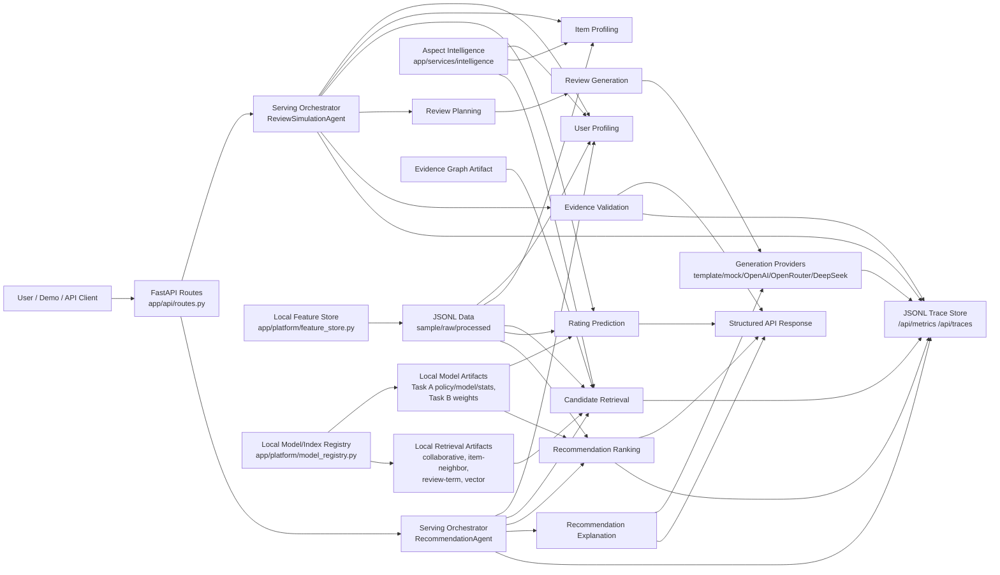
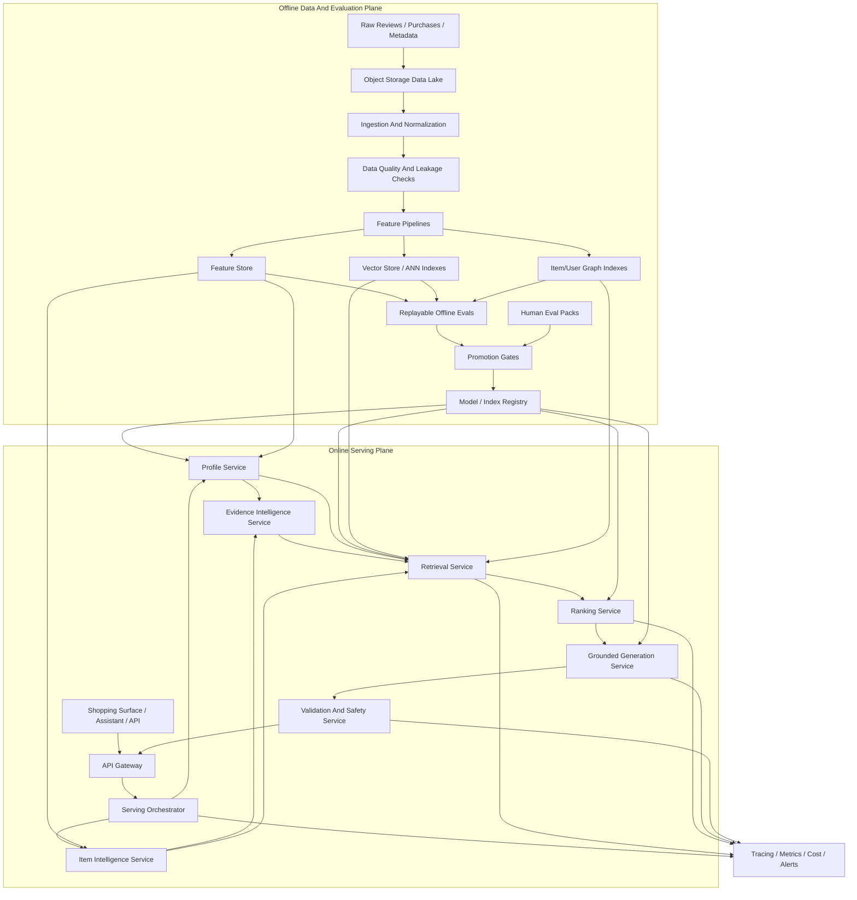
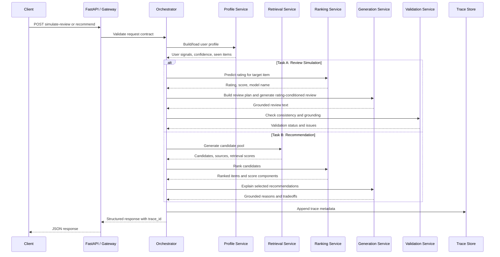
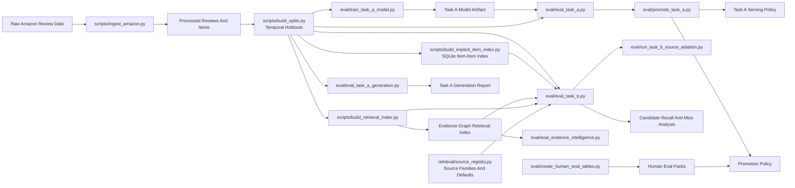

# System Architecture

## Purpose

This document shows Bluechip's current local architecture and the production mapping behind it. The design principle is consistent across both: user and item evidence feed profiling, retrieval, ranking, generation, validation, evaluation, and observability. LLMs are downstream synthesis components, not the source of ranking truth.

## Current Local Architecture

Current implementation notes:

- `app/serving/orchestrators/` orchestrates task workflows for API serving.
- `app/platform/feature_store.py` is the local feature-store abstraction over processed artifacts.
- `app/platform/model_registry.py` is the local model/index registry abstraction.
- `app/services/intelligence/` extracts aspect-aware evidence used by profiling, retrieval, ranking, and generation.
- `app/services/retrieval/` implements a local multi-head retrieval layer: collaborative co-engagement, user-neighbor retrieval, review-term retrieval, lexical item-neighbor retrieval, evidence graph retrieval, BM25, category-affinity popularity, global fallback, and deterministic vector diagnostics.
- `app/services/retrieval/evidence_graph.py` adds aspect graph and sequential retrieval paths.
- `app/services/ranking/` implements multi-objective scoring over preference, context, category, aspect, sequential, evidence graph, Nigerian-context, collaborative, retrieval, diversity, popularity, novelty, quality, and confidence features.
- `app/services/generation/review_plan.py` implements plan-then-write review generation.
- `app/services/validation/evidence_critic.py` validates grounding and sensitive-inference risk.
- `app/agents/` remains as a compatibility shim for older imports.
- `app/services/` contains profiling, retrieval, ranking, generation, and validation tools.
- `eval/` contains offline metrics, training, and promotion scripts.
- `scripts/` contains ingestion, split building, retrieval-index building, and dataset utilities.
- `runs/traces/requests.jsonl` stores local observability records.

## MTMH, HSTU, And Multi-Tower Alignment

The architecture review called out a real gap between semantic relevance and co-engagement recall. The local system now addresses that gap structurally, while keeping heavier neural models behind promotion gates.

| Architecture concept | Local implementation now | Production upgrade path |
| --- | --- | --- |
| MTMH multi-head retrieval | Multiple retrieval heads feed one attributed candidate pool: co-visitation, user-neighbor CF, review-term, lexical-neighbor, evidence graph, BM25, vector diagnostic, category-affinity popularity, and global fallback. | Train a true multi-task multi-head retriever that jointly optimizes candidate recall and semantic relevance. |
| Multi-task objective | Eval reports candidate Recall@50/100/1000 separately from HitRate@10 and NDCG@10; ranker components expose relevance, context, graph, collaborative, and diversity signals. | Promote learned retrieval/ranking artifacts only when fixed same-slice recall and ranking metrics improve together. |
| HSTU-style sequential ranking | Current ranker has sequential and evidence graph features, but not an HSTU neural sequence model. | Add HSTU or another sequence-aware ranker after retrieval recall improves enough for top-rank modeling to matter. |
| Multi-tower diversity | User, item, aspect, context, collaborative, graph, and popularity signals are separate towers feeding scoring; source diversity is explicit. | Learn tower weights or neural tower representations once the hybrid baseline is beaten by fixed eval. |

This wording is deliberate: the repo has implemented the serving boundaries, retrieval heads, features, diagnostics, and promotion discipline required by the feedback. It does not overclaim that MTMH or HSTU has already been trained.

## Amazon-Scale Target Architecture

Target implementation notes:

- Offline systems own data correctness, features, indexes, evals, and promotion.
- Online systems own latency, fallback behavior, traceability, and API contracts.
- Model and index promotion is gated by fixed evaluation reports.
- Runtime traces include model versions, index versions, retrieval source mix, latency, cost, fallback reason, and validation status.

## Online Request Flow

## Offline Data, Evaluation, And Promotion Flow

Promotion rules:

- Task A rating artifacts must beat the current serving policy on fixed RMSE-first evaluation.
- Task A generation changes must preserve validation, grounding, and text-quality metrics.
- Task B ranker artifacts must beat filtered popularity and the current hybrid ranker on the same holdout.
- Retrieval changes must report candidate Recall@K and miss analysis before ranker changes are trusted.
- Retrieval sources must be promoted through the source registry and ablation runner so serving defaults, ranking features, and eval diagnostics stay in sync.

## Service Ownership Map

| Area | Current Local Modules | Target Owner | Primary Metrics |
| --- | --- | --- | --- |
| Product narrative | `README.md`, `docs/product/`, `paper/solution_paper.md` | Product / Principal Engineer | launch metric, guardrails, non-goals |
| Data ingestion | `scripts/ingest_amazon.py`, `scripts/build_splits.py` | Data Platform | data validity, leakage checks, split reproducibility |
| User intelligence | `app/services/profiling/`, `app/services/intelligence/` | Personalization ML | profile confidence, aspect coverage, slice performance |
| Item intelligence | `app/services/profiling/item_profile.py` | Personalization ML | metadata coverage, item quality signals |
| Retrieval | `app/services/retrieval/`, `scripts/build_retrieval_index.py`, `scripts/build_evidence_graph.py` | Retrieval ML | candidate Recall@K, source coverage, miss causes |
| Ranking | `app/services/ranking/`, `eval/eval_task_b.py` | Ranking ML | RMSE, NDCG@10, HitRate@10 |
| Generation | `app/services/generation/`, `prompts/` | Generation Quality | grounding, text quality, fallback rate |
| Validation | `app/services/validation/` | Trust And Safety | consistency rate, unsafe explanation rate |
| Evaluation | `eval/`, `docs/evaluation/` | Eval Quality | fixed reports, human scores, promotion decisions |
| Serving | `app/api/`, `app/serving/orchestrators/` | Platform | latency, API stability, fallback behavior |
| Feature store and registry | `app/platform/`, `scripts/build_model_registry.py` | ML Platform | artifact versions, point lookups, registry completeness |
| Observability | `app/stores/trace_store.py`, `/api/metrics`, `/api/traces` | Infra / Observability | trace completeness, model/index versions, cost |

## Current Gaps Against Target

- Architecture is local by default, with one FastAPI app and internal service boundaries.
- Feature store and model registry are local implementations; managed cloud equivalents remain deployment work.
- Vector and graph services are still local artifacts rather than managed infrastructure.
- Cloud provisioning is intentionally out of scope for the current repo-local implementation.
- Task B contextual human eval has been scored and summarized; Task A behavioural human eval can still be added for a stronger final paper.
- Dashboards and rollout controls are not implemented yet; `/api/metrics` and `/api/traces` are local substitutes.
- Privacy and safety rules are documented, but broader automated enforcement is still a future step.
